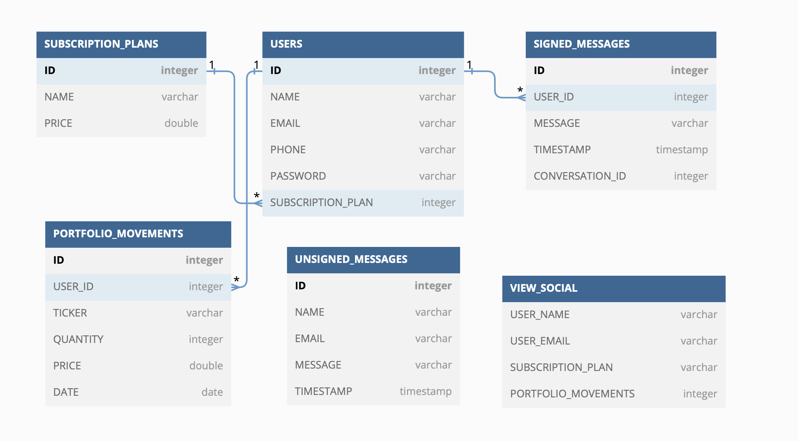

# Stockify - Práctica final
# Proyecto realizado por:
# Carlos Martín de Argila Lorente, Carlos Marí Noguera, Miguel Ángel Fernández Villar

## Introducción:

Este es el repositorio se ha realizada en el cuadro de PROGRAMACIÓN DE APLICACIONES TELEMÁTICAS.
Se ha realizado tanto el frontend como el backend de una aplicación completa para el seguimiento de acciones y mercados financieros y de una cartera. La aplicacion personaliza el conteido para cada usuario mostrandole la información de su cartera una vez que ha iniciado sesión.

## Uso:
Para usarlo hay que ejecutar el backend en el puerto 8080 (por defecto) para que funcione con el front. Como verá tengo el front y el backend en dos carpetas diferentes. Para ejecutar el backend hay que ponerse en la carpeta stockify-api. La web se puede acceder desde [aquí](https://carlos-ag.github.io/202010774-202012230-202009279-PracticaFinal/Stockify/html/presentation.html)

## IMPORTANTE:
Para ejecutar la API hace falta ponerse desde la carpeta stockify-api.
El frontend y el backend están separados (Stockify y stockify-api respectivamente)

- API Noticias (100 noticias por día)
- API Acciones y autocompletado (5 por minuto) compartidas con la API de cotización de acciones

## Overview de la aplicación
La aplicación cuenta con varias secciones:
-1. Presentación: disponemos de una pagina web de presención que permite conocer al usuario de primera mano las funcionalidades de nuestra aplicación así como los planes de suscripción que tiene a su alcance.
-2. Login/Registro: aquí es donde el usuario puede crearse una cuenta o inciar sesión
-3. Aplicación: La aplicación en si, se puede divir en 4 secciones. Aunque la hemos programado para optimizar la UX de tal manera que solo se actualiza el Main, porque como el resto de secciones siempre son iguales no tienen porque cambiar. Las 4 secciones son:
- Header: esta sección se compone de un logo (que te lleva a la página de inicio) y de una search bar autocompletable (cuidado API limit 5 busquedas por minuto) que permite al usuario buscar acciones y para obtener su precio y un gráfico de su cotización. 
- Sidebar: Está sección permite al usuario navegar entre las distintas pantallas de la aplicación. Dispone de varios botones:
1. Inicio: Te da la bienvenida a la aplicación con uan bonita vista de las cotizaciones de los principales indices de Estados Unidos
2. Noticias: Incluye noticias de hoy relevantes a los mercados
3. Resumen: incluye unos gráficos generados en Python con plotly (que en un futuro se podría hacer otro endpoint para ir actualizandolos con los datos reales del usuario)
4. Cartera: En esta pestaña el usuario puede exportar/importar una cartera de acciones desde un CSV, y añadir/modificar/borrar movimientos de la cartera de acciones. Se muestran en una tabla todos los movimientos del usuario
5. Dividendos: Esta página es parecida a la de resumen, solo que en esta se hace un resumen de los dividendos que ha cobrado el usuario. Al igual que resumen, en un futuro se podrían actualizar los plotly con los datos reales del usuario.
6. Social: Esta pestaña permite al usuario relacionarse con otros usuarios de la aplicacion viendo el número de movimientos que han hecho. Puede buscar por usuario, y ver los resultados tanto en forma de tabla como de cards. 
7. Mi perfil: permite al usuario contactar con el soporte técnico con una interfaz similar a la de Whatsapp y también el usuario aquí puede cambiar información relativa a su cuenta. 
8. Cerrar sesión: se cierra sesión de la cuenta existente.
- Main: en el main se muestra el contenido seleccionado en la sidebar o el gráfico de la acción buscada en la search bar.
- Footer: en el footer siempre está disponible un mensaje por si el usuario quiere contactar con soporte técnico.

## Funcionalidades a destacar:
La aplicación cuenta con avanzadas funcionalidades como:
- Autentificación (se verifica que un usuario no autentificado no pueda acceder a contenido restringido a usuarios que han iniciado sesión). Si intentan acceder sin iniciar sesión salta una alerta y se les redirecciona automaticamente a la página del login.
- Cookies
- Views 
- Queries complejas con joins de varias tablas
- logs 
- Tests 
- Llamadas a APIs(tanto del backend como APIs externas), 
- Actualización solamente del contenido cambiantede la web (no toda la web), para optimizar la UX y la velocidad de carga de la web
- SCSS
- Bootstrap
- Transaccionales (principalmente para asegurar que cuando se importa una cartera a través de un CSV se cargue entera la cartera)
- Gestión de errores
- Actuator para verificar que el backend está activo
- UI/UX cuidada tanto en ordenadores como en móviles

## Bases de datos creadas:
Para representar las bases de datos creadas hemos creado el diagrama que se puede ver a continuación:
 

### Tabla: SUBSCRIPTION_PLANS

| Columna | Tipo de Datos | Descripción |
| --- | --- | --- |
| ID | INT, NOT NULL, AUTO_INCREMENT | Identificador único de cada plan de suscripción. |
| NAME | VARCHAR(255), NOT NULL | Nombre del plan de suscripción. |
| PRICE | DOUBLE, NOT NULL | Precio del plan de suscripción. |

### Tabla: USERS

| Columna | Tipo de Datos | Descripción                                                                                                                             |
| --- | --- |-----------------------------------------------------------------------------------------------------------------------------------------|
| ID | INT, NOT NULL, AUTO_INCREMENT | Identificador único de cada usuario.                                                                                                    |
| NAME | VARCHAR(255), NOT NULL | Nombre del usuario.                                                                                                                     |
| EMAIL | VARCHAR(255), NOT NULL | Correo electrónico del usuario.                                                                                                         |
| PHONE | VARCHAR(255), NOT NULL | Teléfono del usuario.                                                                                                                   |
| PASSWORD | VARCHAR(255), NOT NULL | Contraseña del usuario encriptada.                                                                                                      |
| SUBSCRIPTION_PLAN | INT, NOT NULL | Identificador del plan de suscripción al que está suscrito el usuario. Clave foránea que hace referencia a la tabla SUBSCRIPTION_PLANS. |

### Tabla: SIGNED_MESSAGES

| Columna | Tipo de Datos | Descripción |
| --- | --- | --- |
| ID | INT, NOT NULL, AUTO_INCREMENT | Identificador único de cada mensaje firmado. |
| USER_ID | INT, NOT NULL | Identificador del usuario que envía el mensaje. Clave foránea que hace referencia a la tabla USERS. |
| MESSAGE | VARCHAR(255), NOT NULL | Contenido del mensaje. |
| TIMESTAMP | TIMESTAMP, NOT NULL | Fecha y hora en la que se envió el mensaje. |
| CONVERSATION_ID | INT, NOT NULL | Identificador de la conversación a la que pertenece el mensaje. |

### Tabla: UNSIGNED_MESSAGES

| Columna | Tipo de Datos | Descripción |
| --- | --- | --- |
| ID | INT, NOT NULL, AUTO_INCREMENT | Identificador único de cada mensaje sin firmar. |
| NAME | VARCHAR(255), NOT NULL | Nombre del remitente del mensaje. |
| EMAIL | VARCHAR(255), NOT NULL | Correo electrónico del remitente del mensaje. |
| MESSAGE | VARCHAR(255), NOT NULL | Contenido del mensaje. |
| TIMESTAMP | TIMESTAMP, NOT NULL | Fecha y hora en la que se envió el mensaje. |

### Tabla: PORTFOLIO_MOVEMENTS

| Columna | Tipo de Datos | Descripción |
| --- | --- | --- |
| ID | INT, NOT NULL, AUTO_INCREMENT | Identificador único de cada movimiento del portafolio. |
| USER_ID | INT, NOT NULL | Identificador del usuario asociado al movimiento del portafolio. Clave foránea que hace referencia a la tabla USERS. |
| TICKER | VARCHAR(255), NOT NULL | Símbolo de cotización (ticker) del instrumento financiero. |
| QUANTITY | INT, NOT NULL | Cantidad de instrumentos involucrados en el movimiento. |
| PRICE | DOUBLE, NOT NULL | Precio del instrumento financiero en el momento del movimiento. |
| DATE | DATE, NOT NULL | Fecha del movimiento del portafolio. |

### Vista: SOCIAL

| Columna | Descripción |
| --- | --- |
| USER_NAME | Nombre del usuario. |
| USER_EMAIL | Correo electrónico del usuario. |
| SUBSCRIPTION_PLAN | Nombre del plan de suscripción al que está suscrito el usuario. |
| PORTFOL

IO_MOVEMENTS | Cantidad de movimientos del portafolio asociados al usuario. |
 

## Endpoints de la API: TODO releer

A continuación se presenta la documentación de los endpoints de las APIs proporcionadas:

1. **POST /login**
   
   Realiza el inicio de sesión de un usuario con correo y contraseña.
   
   - Parámetros de cuerpo (JSON):
     - `email`: Correo del usuario (String)
     - `password`: Contraseña del usuario (String)
   
   - Respuestas:
     - `200 OK`: Si las credenciales son correctas y el inicio de sesión es exitoso.
     - `400 BAD_REQUEST`: Si las credenciales son incorrectas.

2. **GET /portfolio/{userID}**
   
   Obtiene el portafolio del usuario especificado por el ID de usuario.
   
   - Parámetros de ruta:
     - `userID`: ID del usuario (Integer)
   
   - Respuestas:
     - `200 OK`: Si se encuentra el portafolio del usuario.
     - `400 BAD_REQUEST`: Si ocurre un error al obtener el portafolio.
     - `500 INTERNAL_SERVER_ERROR`: Si ocurre un error inesperado.

3. **POST /movement**

   Añade un nuevo movimiento al portafolio.

   - Parámetros de cuerpo (JSON):
     - `payload`: Objeto PortfolioMovement

   - Respuestas:
     - `200 OK`: Si se añade correctamente el movimiento.
     - `400 BAD_REQUEST`: Si ocurre un error al añadir el movimiento.
     - `500 INTERNAL_SERVER_ERROR`: Si ocurre un error inesperado.

4. **POST /movement/update**
   
   Actualiza un movimiento existente en el portafolio.
   
   - Parámetros de cuerpo (JSON):
     - `payload`: Objeto PortfolioMovement con los datos actualizados
   
   - Respuestas:
     - `200 OK`: Si se actualiza correctamente el movimiento.
     - `400 BAD_REQUEST`: Si ocurre un error al actualizar el movimiento.
     - `500 INTERNAL_SERVER_ERROR`: Si ocurre un error inesperado.

5. **GET /movement/{movementID}**
   
   Obtiene un movimiento específico del portafolio por su ID.

   - Parámetros de ruta:
     - `movementID`: ID del movimiento (Integer)
   
   - Respuestas:
     - `200 OK`: Si se encuentra el movimiento.
     - `400 BAD_REQUEST`: Si ocurre un error al obtener el movimiento.
     - `500 INTERNAL_SERVER_ERROR`: Si ocurre un error inesperado.

6. **POST /upload**
   
   Carga y procesa un archivo CSV con movimientos del portafolio.
   
   - Parámetros de formulario:
     - `file`: Archivo CSV
   
   - Respuestas:
     - `200 OK`: Si el archivo se carga y procesa con éxito.
     - `500 INTERNAL_SERVER_ERROR`: Si ocurre un error al cargar o procesar el archivo.

7. **GET /download/{userID}**

   Descarga en formato CSV los movimientos del portafolio del usuario.

   - Parámetros de ruta:
     - `userID`: ID del usuario (Integer)

   - Respuestas:
     - `200 OK`: Si el archivo se descarga con éxito.
     - `404 NOT_FOUND`: Si no se encuentra el archivo.
     - `500 INTERNAL_SERVER_ERROR`: Si ocurre un error al descargar el archivo.

8. **DELETE /movement/{movementID}**

   Elimina un movimiento específico del portafolio.

   - Parámetros de ruta:
     - `movementID`: ID del movimiento (Integer)
   
   - Respuestas:
     - `200 OK`: Si el movimiento se

8. **POST /movement**

Añade un nuevo movimiento al portafolio.

- Cuerpo de la solicitud (JSON):
  - `payload`: Objeto PortfolioMovement

- Respuestas:
  - `200 OK`: Devuelve el movimiento agregado si la operación es exitosa.
  - `400 BAD_REQUEST`: Si ocurre un error al añadir el movimiento.
  - `500 INTERNAL_SERVER_ERROR`: Si ocurre un error inesperado.

9. **POST /movement/update**

Actualiza un movimiento en el portafolio.

- Cuerpo de la solicitud (JSON):
  - `payload`: Objeto PortfolioMovement

- Respuestas:
  - `200 OK`: Devuelve el movimiento actualizado si la operación es exitosa.
  - `400 BAD_REQUEST`: Si ocurre un error al actualizar el movimiento.
  - `500 INTERNAL_SERVER_ERROR`: Si ocurre un error inesperado.

10. **GET /movement/{movementID}**

Obtiene un movimiento específico del portafolio.

- Parámetros de ruta:
  - `movementID`: ID del movimiento (Integer)

- Respuestas:
  - `200 OK`: Devuelve el movimiento si la operación es exitosa.
  - `400 BAD_REQUEST`: Si ocurre un error al obtener el movimiento.
  - `500 INTERNAL_SERVER_ERROR`: Si ocurre un error inesperado.

11. **POST /upload**

Sube un archivo CSV y añade los movimientos al portafolio.

- Parámetros de formulario:
  - `file`: Archivo CSV a subir.

- Respuestas:
  - `200 OK`: Si el archivo se sube y procesa correctamente.
  - `500 INTERNAL_SERVER_ERROR`: Si ocurre un error inesperado.

12. **GET /download/{userID}**

Descarga los movimientos del portafolio de un usuario en un archivo CSV.

- Parámetros de ruta:
  - `userID`: ID del usuario (Integer)

- Respuestas:
  - `200 OK`: Si se descarga el archivo correctamente.
  - `404 NOT_FOUND`: Si el archivo no se encuentra.
  - `500 INTERNAL_SERVER_ERROR`: Si ocurre un error inesperado.

13. **DELETE /movement/{movementID}**

Elimina un movimiento específico del portafolio.

- Parámetros de ruta:
  - `movementID`: ID del movimiento (Integer)

- Respuestas:
  - `200 OK`: Si se elimina el movimiento correctamente.
  - `500 INTERNAL_SERVER_ERROR`: Si ocurre un error inesperado.

14. **POST /signedMessages**

Añade un nuevo mensaje firmado.

- Cuerpo de la solicitud (JSON):
  - `signedMessageDTO`: Objeto SignedMessageDTO

- Respuestas:
  - `200 OK`: Devuelve el mensaje firmado agregado si la operación es exitosa.
  - `400 BAD_REQUEST`: Si ocurre un error al añadir el mensaje.
  - `500 INTERNAL_SERVER_ERROR`: Si ocurre un error inesperado.

15. **GET /signedMessages/{messageID}**

Obtiene un mensaje firmado específico.

- Parámetros de ruta:
  - `messageID`: ID del mensaje firmado (Integer)

- Respuestas:
  - `200 OK`: Devuelve el mensaje firmado si la operación es exitosa.
  - `400 BAD_REQUEST`: Si ocurre un error al obtener el mensaje.
  - `500 INTERNAL_SERVER_ERROR`: Si ocurre un error inesperado.

16. **DELETE /signedMessages/{messageID}**

Elimina un mensaje firmado específico.

- Parámetros de ruta:
  - `messageID`: ID del mensaje firmado (Integer)

- Respuestas:
  - `200 OK`: Si se elimina el mensaje firmado correctamente.
  - `500 INTERNAL_SERVER_ERROR`: Si ocurre un error inesperado.

17. **GET /signedMessages**

Obtiene todos los mensajes firmados.

- Respuestas:
  - `200 OK`: Devuelve una lista de todos los mensajes firmados.
  - `500 INTERNAL_SERVER_ERROR`: Si ocurre un error inesperado.

18. **PUT /signedMessages/{messageID}**

Actualiza un mensaje firmado específico.

- Parámetros de ruta:
  - `messageID`: ID del mensaje firmado (Integer)

- Cuerpo de la solicitud (JSON):
  - `signedMessageDTO`: Objeto SignedMessageDTO

- Respuestas:
  - `200 OK`: Devuelve el mensaje firmado actualizado si la operación es exitosa.
  - `400 BAD_REQUEST`: Si ocurre un error al actualizar el mensaje.
  - `500 INTERNAL_SERVER_ERROR`: Si ocurre un error inesperado.

19. **GET /socials**

Obtiene todos los planes de suscripción social.

- Respuestas:
  - `200 OK`: Devuelve una lista de todos los planes de suscripción social.

20. **GET /socials/search**

Busca usuarios por nombre.

- Parámetros de consulta:
  - `name`: Nombre del usuario (String)

- Respuestas:
  - `200 OK`: Devuelve una lista de usuarios que coinciden con el nombre proporcionado.

21. **GET /suscriptionPlans/{suscriptionPlanID}**

Obtiene la información de un plan de suscripción específico.

- Parámetros de ruta:
  - `suscriptionPlanID`: ID del plan de suscripción (Integer)

- Respuestas:
  - `200 OK`: Devuelve la información del plan de suscripción si la operación es exitosa.

22. **GET /subscriptionPlans**

Obtiene todos los planes de suscripción.

- Respuestas:
  - `200 OK`: Devuelve una lista de todos los planes de suscripción.

23. **POST /contact**

Añade un mensaje de contacto.

- Cuerpo de la solicitud (JSON):
  - `message`: Objeto que contiene el mensaje de contacto (Map<String, Object>)

- Respuestas:
  - `200 OK`: Si se añade correctamente el mensaje.
  - `400 BAD_REQUEST`: Si ocurre un error al añadir el mensaje.
  - `500 INTERNAL_SERVER_ERROR`: Si ocurre un error inesperado.

24. **GET /users/{userID}**

Obtiene la información de un usuario específico.

- Parámetros de ruta:
  - `userID`: ID del usuario (Integer)

- Respuestas:
  - `200 OK`: Devuelve la información del usuario si la operación es exitosa.

25. **POST /users/{userID}/update**

Actualiza la información de un usuario específico.

- Parámetros de ruta:
  - `userID`: ID del usuario (Integer)

- Cuerpo de la solicitud (JSON):
  - `updatedUser`: Objeto User
  - `subscriptionPlanId`: ID del plan de suscripción (Integer)

- Respuestas:
  - `200 OK`: Devuelve la información actualizada del usuario si la operación es exitosa.
  - `400 BAD_REQUEST`: Si ocurre un error al actualizar el usuario.
  - `500 INTERNAL_SERVER_ERROR`: Si ocurre un error inesperado. 

26. **POST /users**

Añade un nuevo usuario.

- Cuerpo de la solicitud (JSON):
  - `user`: Objeto User
  - `subscriptionPlanId`: ID del plan de suscripción (Integer)

- Respuestas:
  - `200 OK`: Devuelve la información del nuevo usuario si la operación es exitosa.
  - `400 BAD_REQUEST`: Si ocurre un error al añadir el usuario.
  - `500 INTERNAL_SERVER_ERROR`: Si ocurre un error inesperado. 

## Tests 

### Clase `E2EPortfolio`

Esta clase contiene pruebas de extremo a extremo para las funcionalidades del controlador `Portfolio`.

#### Test `getPortfolio()`

El test `getPortfolio()` verifica la funcionalidad de `GET /portfolio/userID`. Se espera que este endpoint retorne la lista de todos los movimientos de un usuario.

En este test se hacen las siguientes comprobaciones:
- El código de estado de la respuesta debe ser 200 (OK).
- El tipo de contenido de la respuesta debe ser JSON.
- Los datos de la respuesta deben coincidir con las expectativas, basándose en los movimientos de la cartera precargados para el usuario.

#### Test `addMovement()`

El test `addMovement()` verifica la funcionalidad de `POST /portfolio/movement`. Se espera que este endpoint agregue un movimiento al portfolio del usuario.

En este test se hacen las siguientes comprobaciones:
- El código de estado de la respuesta debe ser 200 (OK).
- El tipo de contenido de la respuesta debe ser JSON.
- Los datos de la respuesta deben coincidir con el movimiento de la cartera que se intentó agregar.

#### Test `updateMovement()`

El test `updateMovement()` verifica la funcionalidad de `POST /portfolio/movement/update`. Se espera que este endpoint actualice un movimiento en el portfolio del usuario.

En este test se hacen las siguientes comprobaciones:
- El código de estado de la respuesta debe ser 200 (OK).
- El tipo de contenido de la respuesta debe ser JSON.
- Los datos de la respuesta deben coincidir con el movimiento de la cartera que se intentó actualizar.

#### Test `getMovement()`

El test `getMovement()` verifica la funcionalidad de `GET /portfolio/movement/{movementID}`. Se espera que este endpoint retorne un movimiento específico del portfolio del usuario.

En este test se hacen las siguientes comprobaciones:
- El código de estado de la respuesta debe ser 200 (OK).
- El tipo de contenido de la respuesta debe ser JSON.
- Los datos de la respuesta deben coincidir con el movimiento de la cartera que se solicitó.

#### Test `deleteMovement()`

El test `deleteMovement()` verifica la funcionalidad de `DELETE /portfolio/movement/{movementID}`. Se espera que este endpoint elimine un movimiento específico del portfolio del usuario.

En este test se hacen las siguientes comprobaciones:
- El código de estado de la respuesta debe ser 200 (OK).
- Después de la eliminación, al intentar obtener el movimiento de la cartera, se debería recibir un código de estado 200 (OK), lo que indica que el movimiento fue eliminado con éxito.

### Clase `E2ESignedMessage`

Esta clase contiene pruebas de extremo a extremo para la funcionalidad del controlador `SignedMessage`.

#### Test `positive_getLastId()`

El test `positive_getLastId()` verifica la funcionalidad del endpoint `GET /lastConversationId`. Se espera que este endpoint retorne el ID de la última conversación.

En este test se hacen las siguientes comprobaciones:
- El código de estado de la respuesta debe ser 200 (OK).
- El cuerpo de la respuesta debe ser igual al ID de la última conversación que se espera.

### Clase `E2ESocialController`

Esta clase contiene pruebas de extremo a extremo para las funcionalidades del controlador `Social`.

#### Test `getAllPositive()`

El test `getAllPositive()` verifica la funcionalidad del endpoint `GET /socials`. Se espera que este endpoint retorne la lista de todos los usuarios sociales.

En este test se hacen las siguientes comprobaciones:
- El código de estado de la respuesta debe ser 200 (OK).
- Los nombres de los usuarios en la respuesta deben coincidir con los nombres esperados.

#### Test `getUsersByNameTest()`

El test `getUsersByNameTest()` verifica la funcionalidad del endpoint `GET /socials/search?name={name}`. Se espera que este endpoint retorne una lista de usuarios que coincidan con el nombre proporcionado.

En este test se hacen las siguientes comprobaciones:
- El código de estado de la respuesta debe ser 200 (OK).
- Los nombres de los usuarios en la respuesta deben coincidir con el nombre buscado.

### Clase `E2ESubscription`

Esta clase contiene pruebas de extremo a extremo para las funcionalidades del controlador `Subscription`.

#### Test `positive_getSuscriptionPlanInfo()`

El test `positive_getSuscriptionPlanInfo()` verifica la funcionalidad del endpoint `GET /subscriptionPlans/{id}`. Se espera que este endpoint retorne la información del plan de suscripción correspondiente al id proporcionado.

En este test se hacen las siguientes comprobaciones:
- El código de estado de la respuesta debe ser 200 (OK).
- El nombre del plan de suscripción en la respuesta debe ser igual al nombre esperado.
- El precio del plan de suscripción en la respuesta debe ser igual al precio esperado.

#### Test `positive_getAllSuscriptionPlans()`

El test `positive_getAllSuscriptionPlans()` verifica la funcionalidad del endpoint `GET /subscriptionPlans`. Se espera que este endpoint retorne la lista de todos los planes de suscripción disponibles.

En este test se hacen las siguientes comprobaciones:
- El código de estado de la respuesta debe ser 200 (OK).
- La lista de planes de suscripción en la respuesta debe ser igual a la lista de planes de suscripción esperada.

### Clase `LoginControllerTest`

Esta clase contiene pruebas para la funcionalidad del controlador `LoginController`.

#### Test `loginPositive()`

El test `loginPositive()` verifica la funcionalidad del endpoint `POST /login` con datos correctos. Se espera que este endpoint retorne el estado 200 (OK) cuando se realiza un inicio de sesión válido.

En este test se hacen las siguientes comprobaciones:
- Se prepara una petición con un cuerpo que contiene un email y una contraseña válidos.
- Se realiza la petición POST al endpoint /login.
- Se espera que el código de estado de la respuesta sea 200 (OK).

### Clase `SignedMessageControllerTest`

Esta clase contiene pruebas para la funcionalidad del controlador `SignedMessageController`.

#### Test `addSignedMessage_shouldReturnOk_whenValidMessage()`

Este test verifica que cuando se agrega un mensaje firmado válido, el método retorna un estado 200 (OK).

#### Test `addSignedMessage_shouldReturnBadRequest_whenInvalidMessage()`

Este test verifica que cuando se agrega un mensaje firmado inválido, el método retorna un estado 400 (BadRequest).

#### Test `addSignedMessage_shouldReturnInternalServerError_whenUnexpectedError()`

Este test verifica que cuando se encuentra un error inesperado al agregar un mensaje firmado, el método retorna un estado 500 (InternalServerError).

#### Test `getLastConversationId_shouldReturnOk()`

Este test verifica que cuando se obtiene el último ID de conversación, el método retorna un estado 200 (OK).

#### Test `getSignedMessages_shouldReturnOk_whenValidConversationId()`

Este test verifica que cuando se obtienen mensajes firmados con un ID de conversación válido, el método retorna un estado 200 (OK).

#### Test `getLatestMessagesByUserId_shouldReturnOk_whenValidUserId()`

Este test verifica que cuando se obtienen los últimos mensajes por un ID de usuario válido, el método retorna un estado 200 (OK).

#### Test `getSignedMessages_shouldReturnBadRequest_whenInvalidConversationId()`

Este test verifica que cuando se obtienen mensajes firmados con un ID de conversación inválido, el método retorna un estado 400 (BadRequest).

#### Test `getSignedMessages_shouldReturnInternalServerError_whenUnexpectedError()`

Este test verifica que cuando se encuentra un error inesperado al obtener mensajes firmados, el método retorna un estado 500 (InternalServerError).

#### Test `getLatestMessagesByUserId_shouldReturnBadRequest_whenInvalidUserId()`

Este test verifica que cuando se obtienen los últimos mensajes por un ID de usuario inválido, el método retorna un estado 400 (BadRequest).

#### Test `getLatestMessagesByUserId_shouldReturnInternalServerError_whenUnexpectedError()`

Este test verifica que cuando se encuentra un error inesperado al obtener los últimos mensajes por ID de usuario, el método retorna un estado 500 (InternalServerError).

### Clase `SubscriptionPlanControllerTest`

Esta clase contiene pruebas para la funcionalidad del controlador `SubscriptionPlanController`.

#### Test `getSuscriptionPlanInfo_shouldReturnSuscriptionPlanInfo()`

Esta prueba verifica que cuando se solicita la información de un plan de suscripción válido, el método retorna un estado 200 (OK) junto con los detalles del plan de suscripción.

#### Test `getAllSuscriptionPlans_shouldReturnAllSuscriptionPlans()`

Esta prueba verifica que cuando se solicitan todos los planes de suscripción, el método retorna un estado 200 (OK) junto con una lista de todos los planes de suscripción.

#### Test `getSuscriptionPlanInfo_shouldReturnBadRequest_whenInvalidId()`

Esta prueba verifica que cuando se solicita la información de un plan de suscripción con un ID inválido, el método retorna un estado 400 (BadRequest).

#### Test `getSuscriptionPlanInfo_shouldReturnInternalServerError_whenUnexpectedError()`

Esta prueba verifica que cuando se encuentra un error inesperado al solicitar la información de un plan de suscripción, el método retorna un estado 500 (InternalServerError).

### Clase `UnsignedMessageControllerTest`

Esta clase contiene pruebas para la funcionalidad del controlador `UnsignedMessageController`.

#### Test `addContactMessage_shouldAddMessage()`

Esta prueba verifica que cuando se envía un mensaje de contacto válido, el método retorna un estado 200 (OK) y se agrega el mensaje correctamente.

#### Test `addContactMessage_shouldReturnBadRequest_whenInvalidPayload()`

Esta prueba verifica que cuando se envía un mensaje de contacto con una carga útil inválida (por ejemplo, un nombre nulo), el método retorna un estado 400 (BadRequest). En este caso, el servicio lanza una excepción `IllegalArgumentException`.

#### Test `addContactMessage_shouldReturnInternalServerError_whenUnexpectedError()`

Esta prueba verifica que cuando se produce un error inesperado al enviar un mensaje de contacto, el método retorna un estado 500 (InternalServerError). En este caso, el servicio lanza una excepción `RuntimeException`.

### Clase `UserControllerTest`

Esta clase contiene pruebas para la funcionalidad del controlador `UserController`.

#### Test `getUserInfo_shouldReturnUserInfo()`

Esta prueba verifica que cuando se solicita la información de un usuario existente, el método retorna un estado 200 (OK) y la información correcta del usuario.

#### Test `addUser_shouldAddUser()`

Esta prueba verifica que cuando se intenta agregar un usuario con una carga útil válida, el método retorna un estado 200 (OK) y el usuario se agrega correctamente.

#### Test `addUser_shouldReturnBadRequest_whenInvalidData()`

Esta prueba verifica que cuando se intenta agregar un usuario con una carga útil inválida (por ejemplo, un correo electrónico inválido), el método retorna un estado 400 (BadRequest). En este caso, el servicio lanza una excepción `IllegalArgumentException`.

#### Test `addUser_shouldReturnInternalServerError_whenUnexpectedError()`

Esta prueba verifica que cuando se produce un error inesperado al intentar agregar un usuario, el método retorna un estado 500 (InternalServerError). En este caso, el servicio lanza una excepción `RuntimeException`.

## Instalación:
Necesita un editor de texto como puede ser VSCode y un navegador para visualizar la página web.
Si lo desea para facilitar el desarrollo de la página web puede la extensión de VSCode llamada Live Server que sirve para ver en directo los cambios realizados en el HTML sin necesidad de recargar la página web. También recomendamos el uso de Live Sass Compiler para facilitar el desarrollo de los archivos CSS ya que compila los archivos SASS a CSS en tiempo real.
